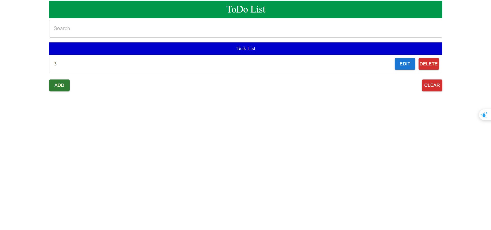
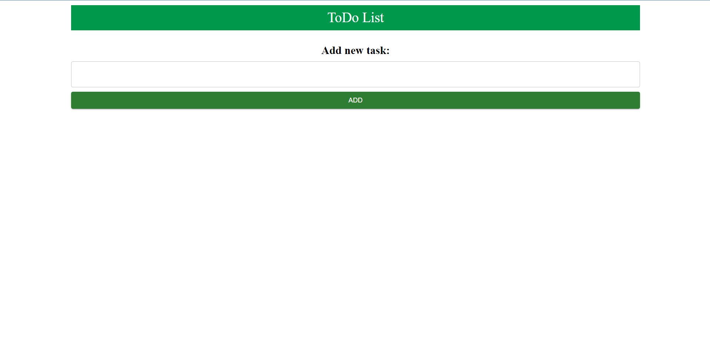
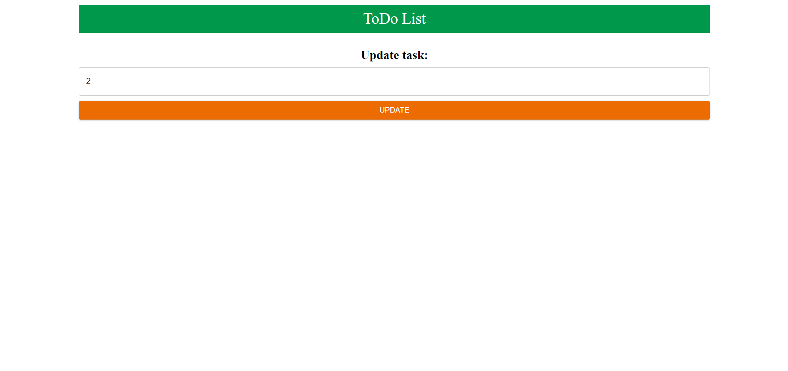

# ReactJS Todo List with Vite

A simple Todo List application built with ReactJS and Vite.

## Features

- Add new tasks
- Mark tasks as complete or incomplete
- Delete tasks
- Persistent data storage using browser's local storage

## Screenshots






## How to Use

1. Clone the repository:
```
git clone https://github.com/HHiepShadow/todolist-reactjs.git
```

2. Navigate to the project directory:
```
cd todolist
```

3. Install the dependencies:
```
npm install
```

4. Start the development server:
```
npm run dev
```

5. Open your web browser and visit `http://localhost:5173` to see the Todo List app.

## Technologies Used

- [ReactJS](https://reactjs.org/) - A JavaScript library for building user interfaces
- [Vite](https://vitejs.dev/) - A fast and lightweight build tool for modern web applications
- [localStorage](https://developer.mozilla.org/en-US/docs/Web/API/Window/localStorage) - Web API for storing data in the browser
- [uuid](https://www.npmjs.com/package/uuid) - A library for generating unique IDs

## Contributing

If you find any issues or have suggestions for improvements, feel free to open an issue or submit a pull request.

## License

This project is licensed under the [MIT License](LICENSE).
